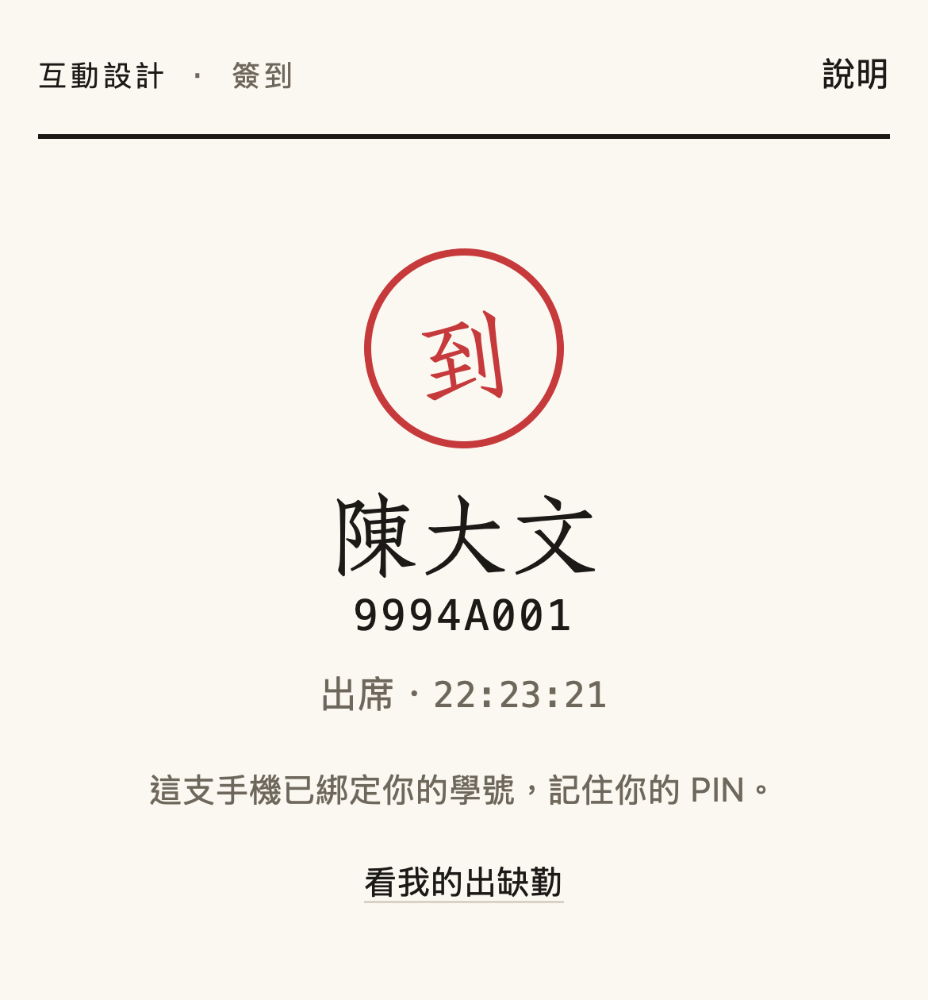
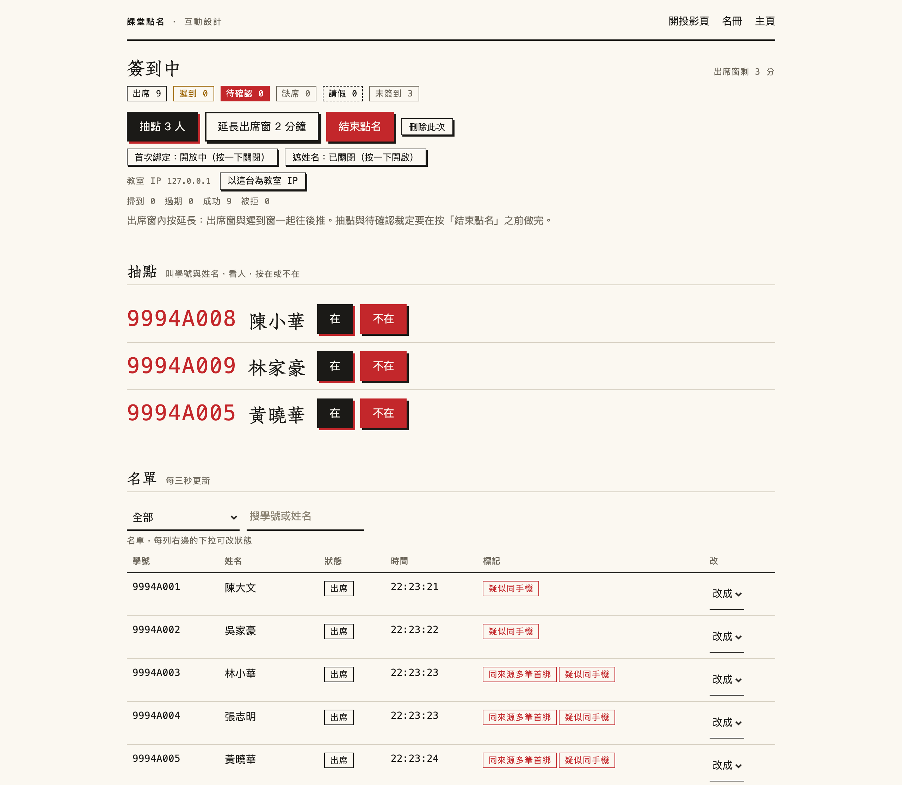

# 課堂點名系統

[English](README.md) | **繁體中文**

給實體課堂用的自架點名系統。投影幕上的 QR 每十秒換一次，一個學號綁一支手機，老師再隨機抽幾個人叫名。整套只有一個 FastAPI 檔、一個 SQLite 資料庫、一個 Docker 容器。

它要擋的是兩件事：同學幫沒來的人簽到，以及人不在教室卻簽到。

<p>
  
  
</p>

*左：投影頁。右：學生簽到後看到的收據。截圖裡的姓名與學號都是虛構的。*

> 介面只有台灣繁體中文，程式註解與老師用的操作手冊也是中文。

## 怎麼擋

五層，從最省力的排到最靠人的：

| 層 | 做什麼 | 擋不住什麼 |
|---|---|---|
| 輪換 QR | 以 HMAC 簽章的時間片，每 10 秒換一張，換掉之後舊的那張還能用 30 秒。QR 下方有同步更換的六位數，相機掃不到投影幕的手機改到 `/c` 輸碼。 | 把 QR 拍下來傳給教室外的人，最長 40 秒有效 |
| 一個學號一支手機 | 第一次簽到時，伺服器下發 `HttpOnly` cookie（400 天，https 下帶 `__Host-` 前綴）並把學號綁在這支手機上。綁過的學號不能從別支手機簽；已綁定的手機再簽第二個學號，那個學號不會綁上去，兩個人都轉成「待確認」等老師當場看。老師可以解除綁定。 | 把解鎖的手機整支交給同學 |
| PIN | 4 到 6 位數，綁定時自己設，以 PBKDF2-SHA256 儲存。只有綁定與換手機時要輸，平常上課不用。 | — |
| 隨機抽點 | 點名頁抽 N 個人，大字顯示學號與姓名，老師叫名看人。按「不在」那位改缺席，用同一支手機簽的另一位一起改缺席。 | — |
| IP 比對 | 拿學生的公網 IP 跟投影頁的比，只標記不擋。全班多數人走行動網路時這個標記沒有參考性，點名頁會自動不顯示。 | 走行動網路的人 |

講白一點：前三層讓作弊變麻煩，真正抓得到人的是第四層。從來不抽點的話，拿著同學已解鎖手機的人就能替他簽。

## 上課時長什麼樣子

**每門課第一次上課**：開一場「綁定場次」。學生掃碼，填學號、中文全名，設兩次 PIN。這一場開放十分鐘，不記缺席，也不會出現在報表裡。姓名跟名冊字數相同、第一個字相同就放行並標給老師看，異體字不會把人擋在外面。

**之後每次上課**（老師大約花四分鐘）：

1. 筆電開 `/t`，按「開始點名」，把投影頁拖到投影幕。
2. 學生掃碼，頁面已經顯示自己的姓名，按一下就完成，不用輸 PIN。
3. 出席窗（預設 3 分鐘）時間到自動關；之後到遲到上限（預設 15 分鐘）仍可簽，記遲到。出席或遲到看的是手機「掃到」的時間，不是送出表單的時間。
4. 按「抽點」，叫名，按「在」或「不在」。
5. 按「結束點名」，沒簽的人自動記缺席。

點名頁有即時的簽到漏斗（幾支手機掃到、幾次掃到時 QR 已過期、幾人送出、幾人成功），以及連續被拒兩次以上的學生名單與原因。人數不動的時候，看這兩塊就知道是哪一步在掉人。

<p></p>

*抽點中的點名頁。紅色標記是真的偵測結果：這次示範的九支模擬手機都從同一台電腦發出，同手機指紋偵測要抓的正是這種情況。*

其他功能：手機沒電的手動簽到、請假、投影或網路出問題時的整場作廢、把系統自動記的缺席整批更正、單一學生解除綁定與重設 PIN、學期報表、CSV 匯出、學生自查整學期紀錄的頁面（`/me`），以及結束點名時把缺席名單發到 Discord 頻道（選用）。

老師的完整操作流程與例外處理對照表在 [`docs/OPERATIONS.zh-TW.md`](docs/OPERATIONS.zh-TW.md)。

## 快速開始

本機直接跑，不用 Docker：

```bash
python3 -m venv .venv && .venv/bin/pip install -r requirements.txt

export ATTEND_SECRET=$(python3 -c "import secrets;print(secrets.token_hex(32))")
export ATTEND_TEACHER_PASSWORD=change-me

printf 'student_id,name,class\nS001,王小明,示範班\nS002,陳大文,示範班\n' > roster.csv
.venv/bin/python manage.py import-roster --code DEMO --name "示範課程" --csv roster.csv
.venv/bin/uvicorn app:app --port 8000
```

瀏覽器開 <http://127.0.0.1:8000/t> 登入。QR 的內容來自 `ATTEND_BASE_URL`（預設 `http://127.0.0.1:8000`），所以要讓真的手機掃得進來，這個變數必須設成手機連得到的網址。

名冊 CSV 的欄位是 `student_id`、`name`、`class`（中文欄名 `學號`、`姓名`、`班級` 也可以）。重複匯入是安全的：已存在的學生只更新姓名與班級，PIN 與手機綁定不動。`--prune` 會連同退選者的簽到紀錄一起刪，確定要拿掉人的時候才加。

## 部署

```bash
cp .env.example .env && chmod 600 .env      # 填三個必填值
mkdir -p data && sudo chown 10001:10001 data
docker compose build && docker compose up -d
```

容器只聽 `127.0.0.1:3009`，以非 root 帳號執行，檔案系統唯讀，權限全數卸除。前面要有一台終結 TLS 的反向代理。以 Caddy 為例：

```caddyfile
attend.example.edu {
	request_header -CF-Connecting-IP   # 站台有走 Cloudflare 的話拿掉這一行
	reverse_proxy 127.0.0.1:3009
}
```

幾件沒做會出事的：

- **用戶端 IP。** 程式先讀 `CF-Connecting-IP`，沒有才讀 `X-Forwarded-For` 的最後一段。站台走 Cloudflare、而且 origin 只收 Cloudflare 網段時，這樣是對的。沒走 Cloudflare 就要像上面那樣在反向代理把 `CF-Connecting-IP` 拿掉，否則任何學生都能偽造自己的 IP，IP 標記與限流都會失準。
- **只能單一 worker。** 限流計數存在行程的記憶體裡，開多個 worker 會靜悄悄地失效。Dockerfile 本來就只開一個，不要改。
- **學期中不要換 `ATTEND_SECRET`。** 裝置雜湊由它衍生，一換所有課程的手機綁定同時失效。要讓老師的登入失效，按「登出」就好，它會撤銷所有裝置上的老師登入。
- **CDN 快取。** 頁面與 API 回應一律帶 `Cache-Control: private, no-store`（靜態檔快取一週，字型網址帶內容雜湊）；CSV 匯出的路徑是 `/export/csv`、不帶副檔名，因為依副檔名快取的 CDN 會把寫著學生姓名的報表留在邊緣節點好幾個小時。
- **先建置再重啟。** `docker compose build` 做完再 `up -d`，中斷只有幾秒。有點名正在進行的時候不要部署。

### 設定

環境變數：

| 變數 | 必填 | 意義 |
|---|---|---|
| `ATTEND_SECRET` | 是 | QR、老師登入與裝置雜湊共用的簽章金鑰 |
| `ATTEND_TEACHER_PASSWORD` | 是 | 老師端的單一密碼 |
| `ATTEND_BASE_URL` | 正式站必填 | 學生連進來的公開網址。決定 QR 內容、cookie 名稱（https 才用 `__Host-`）與說明頁上印的網址 |
| `ATTEND_DB` | 否 | SQLite 路徑。容器內預設 `/data/attend.db`，其他情況 `./data/attend.db` |
| `DISCORD_TOKEN` | 否 | bot token，要把缺席名單發到 Discord 才需要 |

每門課各自一組的設定，在名冊頁上改，或用 `manage.py set`：

| 鍵 | 預設 | 意義 |
|---|---|---|
| `open_minutes` | 3 | 掃到算「出席」的時間窗 |
| `late_minutes` | 15 | 掃到算「遲到」的上限，自開始起算 |
| `bind_minutes` | 10 | 綁定場次的長度（3 到 30） |
| `qr_interval` | 10 | QR 幾秒換一次（最少 5） |
| `qr_grace` | 30 | 換掉之後舊 QR 還能用幾秒（最多 120） |
| `grant_seconds` | 180 | 掃碼之後填表的時限 |
| `spot_n` | 3 | 每次抽點幾個人 |
| `pin_max_fail` | 3 | 同一支手機 PIN 輸錯幾次後本場鎖定 |
| `ip_check` | true | 比對學生與投影頁的公網 IP（只標記） |
| `allow_bind` | true | 是否開放首次綁定。第一週之後關掉，免得有人拿沒綁過的學號去綁 |
| `discord_channel` | 空 | 缺席名單要發去的頻道 ID |

指令列：

```bash
python manage.py list
python manage.py import-roster --code DEMO --name "示範課程" --csv roster.csv [--prune]
python manage.py set --code DEMO --key qr_grace --value 30
python manage.py delete-course --code DEMO
```

在 Docker 裡，前面加 `docker compose exec -T attend`。名冊可以直接用管線送進去，不落在伺服器磁碟上：`cat roster.csv | ssh 主機 'cd /路徑 && docker compose exec -T attend python manage.py import-roster --code DEMO --name "示範課程" --csv /dev/stdin'`。

`scripts/parse_rosters.py` 是把教務系統匯出檔轉成上述 CSV 的範例，處理清大校務資訊系統的選課名單（Big5 文字檔）與北商的 PoolExport（副檔名是 xls、內容其實是 HTML，一個檔可能含兩門課）。別的學校要照自己的格式改。

## 學生資料

資料庫裡有學號、姓名、班級、加鹽的 PIN 雜湊、裝置雜湊，以及每一筆簽到的時間、公網 IP 與標記，是一個未加密的 SQLite 檔。備份請加密或放在自己管得到的儲存空間；主機放在校外之前，先確認學校的規定；學期結束就把資料刪掉（`manage.py delete-course`，或直接移除 `data/attend.db` 整個清空）。

這個 repo 裡沒有任何真實的學生資料，測試用的學號（`9994A…`、`999…`）與姓名都是虛構的。

## 測試

```bash
uv venv .venv && uv pip install -p .venv/bin/python -r requirements.txt -r tests/requirements-dev.lock
.venv/bin/python -m playwright install chromium webkit
tests/gate.sh --quick     # 九層，幾分鐘
tests/gate.sh --full      # 再加真實時鐘計時、壓測、教室彩排、不穩定測試偵測
```

九層是靜態分析、單元測試（分支覆蓋 97%）、以 Hypothesis 狀態機守住七條不變式、情境腳本、Schemathesis 模糊測試，以及 Playwright 端對端（Chromium 當老師、WebKit 當 iPhone）。每一層在抓什麼、抓不到什麼，寫在 [`tests/README.md`](tests/README.md)。

這個專案不拿覆蓋率當成效指標。第一次進教室試用的時候，上面每一層都是綠的，而連上的 9 支手機只有 6 支簽到成功。伺服器日誌給了原因：17 次掃碼開到頁面，其中 5 次開到的時候 QR 已經過期，5 次都是 Android 手機。學生從相機辨識到瀏覽器送出請求要 5 到 20 秒，而當時舊的 QR 換掉之後只多留 5 秒。所以測試多了一支 `tests/rehearsal.py`：用真的瀏覽器跑三十支模擬手機，延遲模型照那份日誌配適，通過的條件改成教室裡的結果，也就是全班至少 95% 簽到成功、耗時的第 90 百分位數在 60 秒內。

| 教室彩排，30 人，兩個亂數種子 | 重整前 | 重整後 |
|---|---|---|
| 第一次上課：完成綁定的比例 | 87–90% | 97–100% |
| 掃到時 QR 已過期的比例 | 24–36% | 0% |
| 一般上課：簽到耗時第 90 百分位數 | 37–42 秒 | 19–33 秒 |

以上是模擬的數字。重整版第一次實地使用是一個小班：6 支手機掃到，沒有一支開到頁面時已經過期，6 支都綁定成功。

## 目錄

```
app.py                 整個伺服器：路由、資料表、遷移、限流
manage.py              名冊匯入與課程設定的指令列工具
templates/  static/    Jinja 樣板與自架的子集字型
tests/                 gate.sh、各層測試、rehearsal.py
tools/log_funnel.py    從反向代理的存取日誌重建簽到漏斗
tools/subset_font.py   頁面文字或名冊姓名有新字時，重做字型子集
scripts/parse_rosters.py   教務系統匯出檔的解析範例
docs/OPERATIONS.zh-TW.md   老師的操作手冊
```

## 授權

程式碼以 [MIT License](LICENSE) 釋出。

`static/fonts/ZhuqueFangsong-subset.woff2` 是[朱雀仿宋](https://github.com/TrionesType/zhuque)的子集，© 2023 JadeFoci，以 SIL Open Font License 1.1 授權散布，授權全文在 [`static/fonts/OFL.txt`](static/fonts/OFL.txt)。

## 作者

江振維，國立臺北商業大學創意科技與產品設計系。為自己的課寫的，每週上課都在用。
